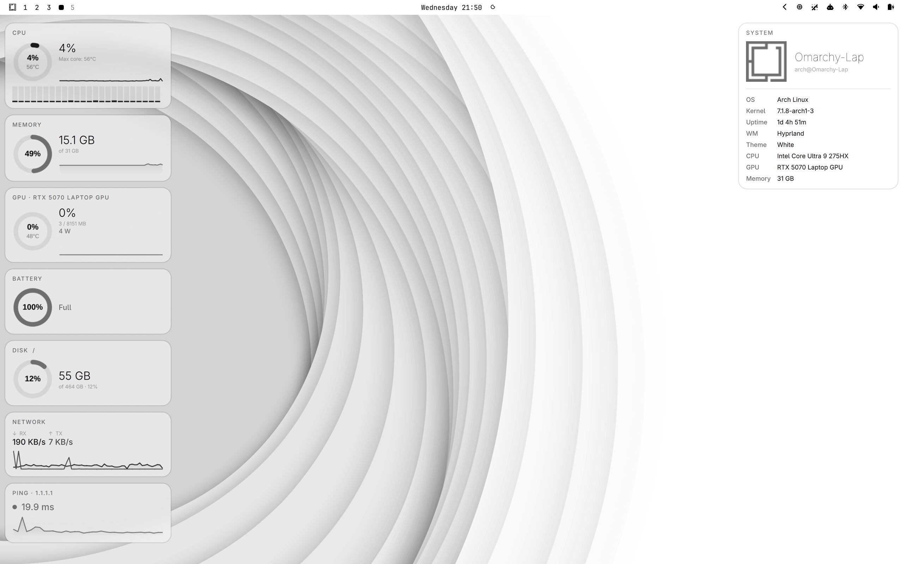
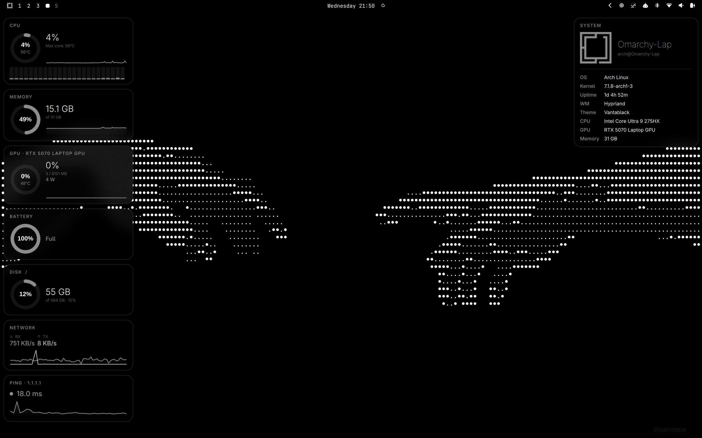
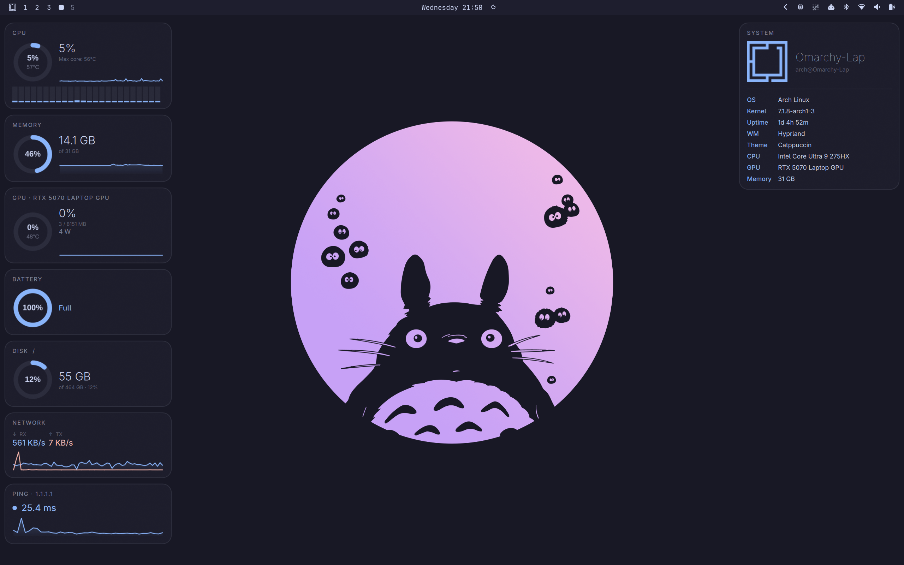
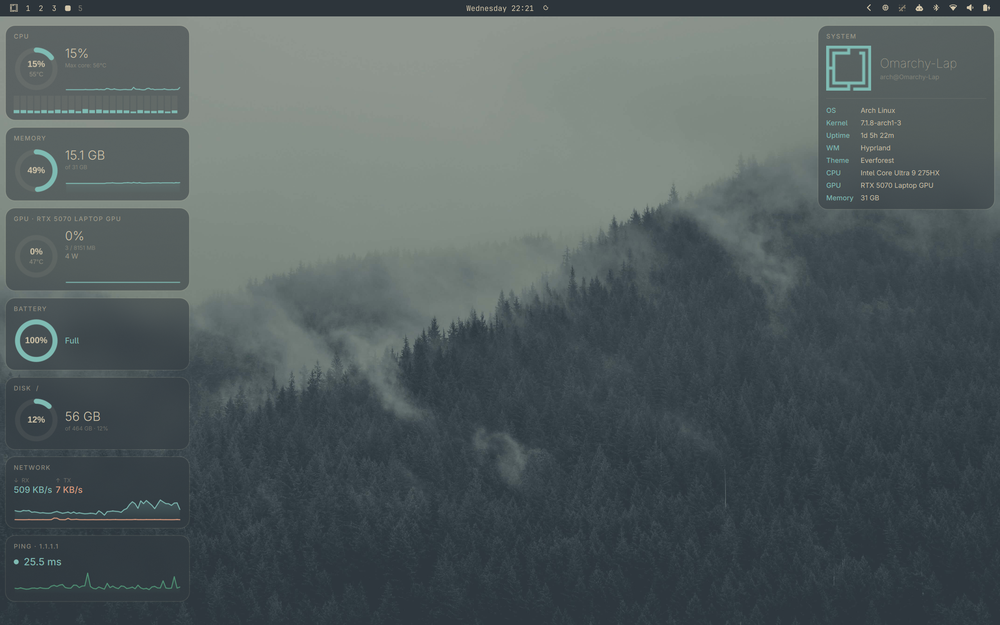
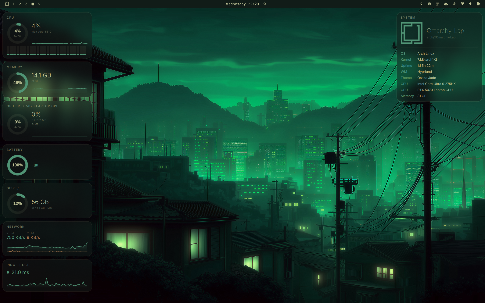

# omarchy-dashboard

A two-panel [Quickshell](https://quickshell.outfoxxed.me/) widget for
[Omarchy](https://omarchy.org) (Hyprland + Arch): live system stats on the
left, neofetch-style info on the right. Glass cards that follow your Omarchy
theme live, no restart needed.

| Tokyo Night | White | Vantablack | Catppuccin |
| ---------------------- | ---------------------- | ---------------------- | ---------------------- |
|  |  |  |  |

| Ethereal | Matte Black | Everforest | Osaka Jade |
| ---------------------- | ---------------------- | ---------------------- | ---------------------- |
|  |  |  |  |

## Features

- Per-core CPU bars, package/core temps, rolling sparkline
- Memory, disk, and NVIDIA GPU usage (utilization, VRAM, temp, power draw)
- Battery status with time-to-full/empty (UPower)
- Network throughput (RX/TX) and ping, both with sparklines
- Now-playing media tile (MPRIS) — art, title/artist, progress bar, and
  prev/play-pause/next controls, for whichever player is currently active
- Neofetch-style system info panel (host, kernel, uptime, WM, theme, CPU, GPU, memory)
- Live theme sync with Omarchy
- Drag-to-reorder and hide/show any tile — see below
- Columns adapt automatically: if the tiles don't fit your screen's height,
  extras overflow into a new column instead of running off-screen

## Reordering & hiding tiles

Double-click any tile to open the reorder panel. Drag tiles up/down to
reorder them, or drag one across into the Hidden column to hide it (drag it
back to bring it back). Changes apply immediately and are remembered
automatically — no config file to edit.

## Dependencies

| Dependency | Used for | Arch package |
| --- | --- | --- |
| [Quickshell](https://quickshell.outfoxxed.me/) | Runs the shell | `quickshell-git` (AUR) |
| Hyprland + [Omarchy](https://omarchy.org) | Live theming | ships with Omarchy |
| Qt5Compat | Theme-colored Omarchy logo (`ColorOverlay`) | `qt6-5compat` |
| `nvidia-smi` | GPU stats (NVIDIA only) | `nvidia-utils` |
| `lm-sensors` | CPU temps | `lm_sensors` |
| `inotify-tools` | Live theme/state watching | `inotify-tools` |
| coreutils | `ping`, `df`, `awk`, `hostname`, `uname` | already on your system |

Run `sudo sensors-detect` once if you've never configured `sensors`, or temp
tiles stay blank.

## Setup

1. Clone into your Quickshell config dir (folder name must stay `dashboard`):

   ```sh
   git clone https://github.com/D3m0nZOnFire/omarchy-dashboard ~/.config/quickshell/dashboard
   ```

2. Run it in the foreground first to catch errors:

   ```sh
   qs -c dashboard
   ```

   Once it looks right, run detached (`qs -c dashboard -d`) or add to
   Hyprland's `exec-once`.

3. **NVIDIA only**: GPU stats come from `nvidia-smi` (`SystemMetrics.qml`).
   On AMD/Intel, swap in `radeontop` or `intel_gpu_top` and adjust the parser.

4. **Enable Hyprland background blur** — required. The cards are translucent
   by design; without blur they're just washed-out gray boxes.

   Omarchy (`~/.config/hypr/looknfeel.lua`):

   ```lua
   hl.config({
     decoration = { blur = { enabled = true, size = 6, passes = 3 } },
   })

   hl.layer_rule({
     match = { namespace = "quickshell:dashboard" },
     blur = true,
     xray = true,
     ignore_alpha = 0.2,
   })
   ```

   Vanilla Hyprland (`hyprland.conf`):

   ```
   decoration {
     blur { enabled = true; size = 6; passes = 3 }
   }

   layerrule = blur, quickshell:dashboard
   layerrule = xray, quickshell:dashboard
   layerrule = ignorealpha 0.2, quickshell:dashboard
   ```

   Then `hyprctl reload`. (`ignore_alpha` skips blurring the fully
   transparent gaps between cards — drop it if you want those blurred too.)

QML edits hot-reload while `qs -c dashboard` is running — no restart needed.

That's it — no config file needed. The panels attach to your laptop panel
automatically (or the first screen, if there isn't one). [`Config.qml`](Config.qml)
is only for edge cases: `screenName` to pin the panels to a specific output on
a multi-monitor desktop, or `pingHost` if `1.1.1.1` doesn't work for you.

## Troubleshooting

- **Blank/zero tiles**: test the underlying command directly (`nvidia-smi`,
  `sensors`, `ping -c1 1.1.1.1`, `df -k /`).
- **Theme doesn't update**: check `inotifywait` is installed and
  `omarchy-theme-color --all` works.
- **Wrong monitor**: set `screenName` in `Config.qml` to the output you want
  (see `hyprctl monitors` for names).
- **Flat gray cards, no blur**: step 4 not done, or reload didn't take —
  check `hyprctl getoption decoration:blur:enabled`.
- **Media tile says "Nothing playing"**: it needs a running player that
  exposes MPRIS — most do (Spotify, browsers playing audio/video, VLC, mpv
  with the `mpris` plugin, etc.).

## License

MIT — see [LICENSE](LICENSE).
