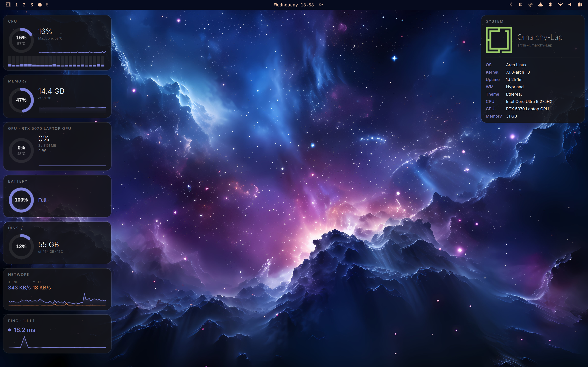
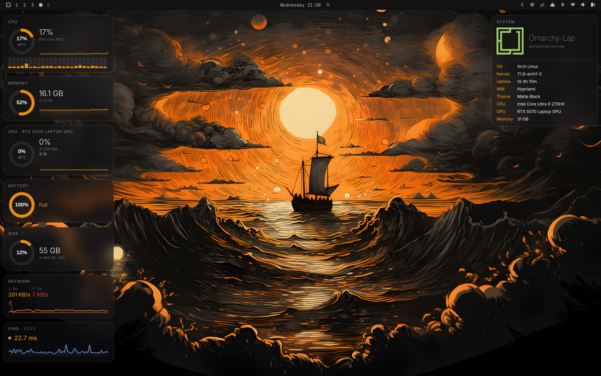
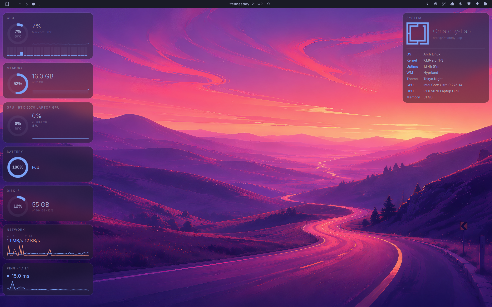

# omarchy-dashboard

A two-panel [Quickshell](https://quickshell.outfoxxed.me/) desktop widget for
[Omarchy](https://omarchy.org) (Hyprland + Arch). A left panel with live
system stats — CPU, memory, GPU, battery, disk, network, ping — and a right
panel with neofetch-style system info, both styled as glass cards that
follow your active Omarchy theme automatically, live, with no restart.

|                        |                        |                        |
| ---------------------- | ---------------------- | ---------------------- |
|  |  |  |
| Ethereal | Matte Black | Tokyo Night |

## Features

- Per-core CPU bars, package/core temps, and a rolling sparkline
- Memory, disk, and NVIDIA GPU usage (utilization, VRAM, temp, power draw)
- Battery status with time-to-full/empty (via UPower)
- Network throughput (RX/TX) and ping to a target host, both with sparklines
- Neofetch-style system info panel (host, kernel, uptime, WM, theme, CPU, GPU, memory)
- Live theme sync: colors update automatically when you switch your Omarchy theme, no restart needed

## Dependencies

| Dependency | Used for | Arch package |
| --- | --- | --- |
| [Quickshell](https://quickshell.outfoxxed.me/) | Runs the shell itself | `quickshell-git` (AUR) |
| Hyprland + [Omarchy](https://omarchy.org) | `omarchy-theme-color` and `~/.local/state/omarchy/current` for live theming | ships with Omarchy |
| `nvidia-smi` | GPU stats — NVIDIA only, see note below | `nvidia-utils` |
| `lm-sensors` | CPU package/core temperatures | `lm_sensors` |
| `inotify-tools` | Live theme + state file watching | `inotify-tools` |
| coreutils | `ping`, `df`, `awk`, `hostname`, `uname` | already on your system |

If `sensors` has never been configured, run `sudo sensors-detect` once (accept the
defaults) or the temperature tiles will just stay blank.

## Setup

1. **Clone into your Quickshell config directory**, keeping the folder name
   `dashboard` — Quickshell uses the folder name as the config name:

   ```sh
   git clone https://github.com/D3m0nZOnFire/omarchy-dashboard ~/.config/quickshell/dashboard
   ```

2. **Run it**:

   ```sh
   qs -c dashboard
   ```

   That starts it in the foreground so you can see any QML errors. Once
   you're happy with it, launch it detached with `qs -c dashboard -d`, or
   add that to your Hyprland `exec-once` so it starts with your session:

   ```
   exec-once = qs -c dashboard
   ```

   (If you're replacing Omarchy's default top bar/shell, make sure nothing
   else is already launching a Quickshell config named `default` for the
   same screen, or you'll get overlapping bars.)

3. **Point it at your machine** — edit [`Config.qml`](Config.qml), the one
   file with every value you're expected to change:

   | Property | What it does | Default |
   | --- | --- | --- |
   | `screenWidth`, `screenHeight` | Resolution used to pick which monitor the panels attach to, for multi-monitor setups | `1600` × `1000` |
   | `pingHost` | Host pinged for the network latency tile | `1.1.1.1` |

   Find your monitor's resolution with `hyprctl monitors` if you're not sure.
   On a single-monitor setup you don't need to touch this — the code falls
   back to your only screen automatically.

4. **NVIDIA-only note**: GPU stats come from `nvidia-smi`
   (`SystemMetrics.qml`, `gpuProc` / `_parseGpu()`). On AMD or Intel graphics
   there's nothing to configure — you'll need to swap that process for
   something like `radeontop` or an `intel_gpu_top`/sysfs read and adjust
   the parser to match its output.

5. **Reload after changes**: Quickshell hot-reloads QML edits automatically
   while `qs -c dashboard` is running — no restart needed while you tweak
   colors, sizes, or layout.

## Troubleshooting

- **Blank/zero tiles**: check the relevant command works standalone in your
  shell first (`nvidia-smi`, `sensors`, `ping -c1 1.1.1.1`, `df -k /`) —
  most tile data comes straight from these.
- **Theme doesn't update on switch**: confirm `inotifywait` is installed and
  that `omarchy-theme-color --all` prints a palette when run manually.
- **Panels on the wrong monitor**: double check `screenWidth`/`screenHeight`
  in `Config.qml` against `hyprctl monitors`.

## License

MIT — see [LICENSE](LICENSE).
